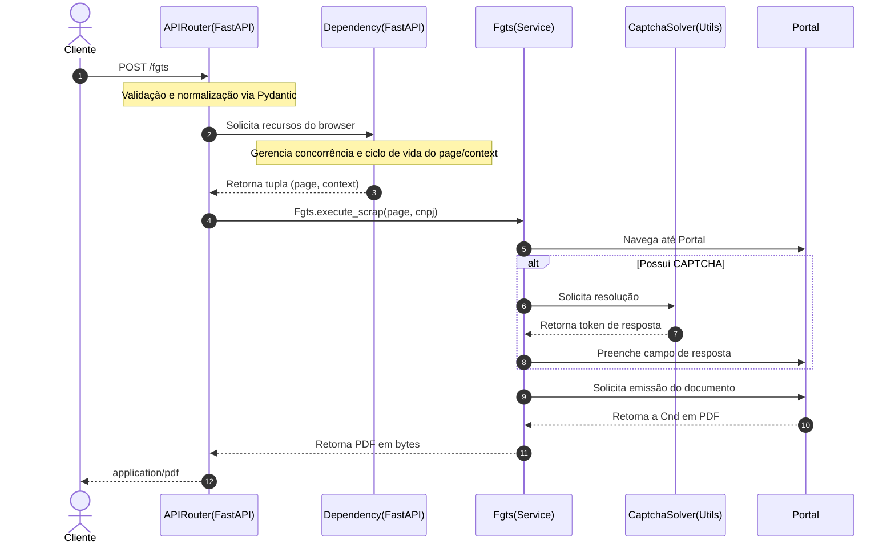

# Dev Docs

### Fluxo

### Tratamento de Erros

Toda função ou método de execução de scraping é encapsulado pelo decorador `@handle_scrap_errors`.

Dessa forma, quando um erro é levantado durante a execução, temos o seguinte comportamento padronizado:
1. Captura o estado atual da página e salva a imagem em `/screenshot/{nome}.png`.
2. Extrai e compila as informações disponíveis da requisição para estruturar um erro `ScrapError` padronizado e propaga esse erro.

> [!WARNING]
> A captura de tela (screenshot) pode falhar ou não ser gerada caso ocorra um timeout durante o carregamento da página.
---

### Estrutura de Pastas e Componentes

A estrutura interna do projeto foi desenhada para manter a lógica de scraping desacoplada da infraestrutura de rotas e configurações.

* `app/core/`: Centraliza a infraestrutura principal do sistema.
* `app/router/`: Centraliza a lógica HTTP e a validação de entrada das requisições.
* `app/schemas/`: Define modelos de dados, serialização e validação das requisições e respostas da API.
* `app/services/`: Centraliza a lógica de negócios e automação dos fluxos de scraping.
* `app/utils/`: Contém funções auxiliares.
* `app/exceptions/`: Define erros personalizados e manipuladores globais (handlers) de falhas.
